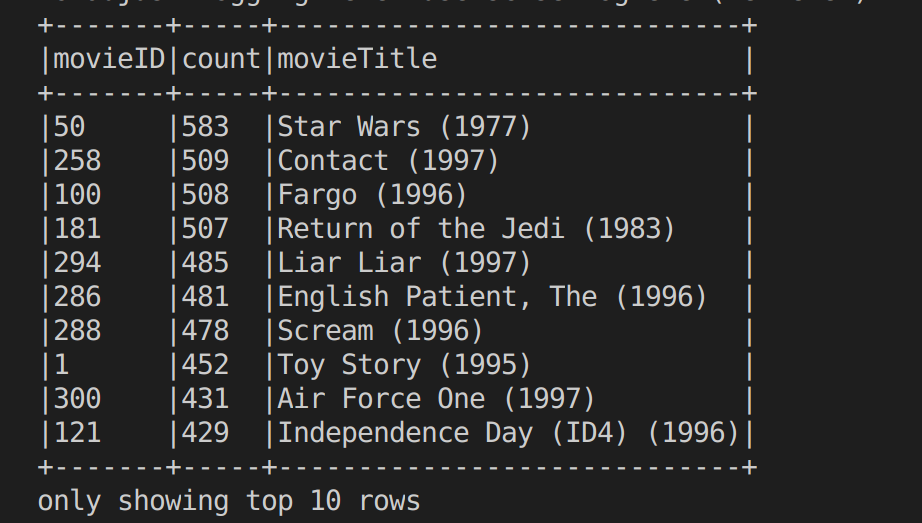
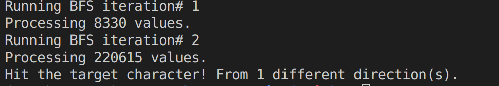
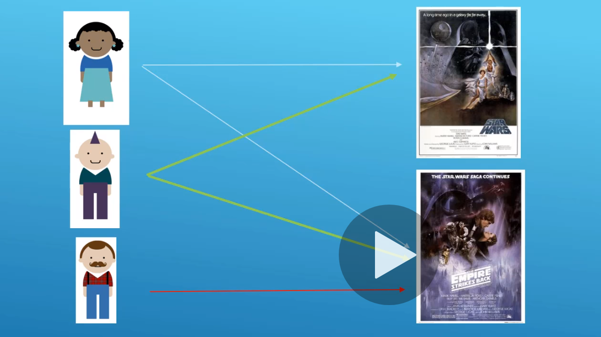
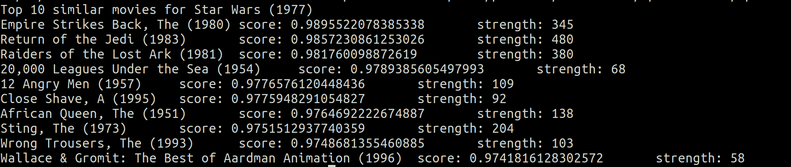

# 4- Advanced Examples of Spark Programs
1. [Broadcast variables](#schema1)
2. [Most popular superhero](#schema2)
3. [Introducing Breadth-First-Search](#schema3)
4. [Item-Based Collaborative Filtering in Spark, cache(), and persist()](#schema4)

# 1. Broadcast varialbes
`popular-movies-nice-dataframe.py`
Las variables difundidas (conocidas en la terminología inglesa como broadcast variables) permiten guardar una variable de solo lectura en cada máquina, sin necesidad de enviar una copia de esta cada vez que se envíe una tarea al nodo. 

Cuando se definen múltiples transformaciones y operaciones, Spark automáticamente dispersa los datos necesarios por las tareas en cada etapa. Difundir explícitamente variables solo es útil cuando las tareas, en sus múltiples etapas, necesitan siempre los mismos datos.

Para difundir una variable se debe usar el método broadcast(var) de la clase SparkContext.
1º Cargamos las librerías  importamos codecs, porque vamos a usar u.ITEM
~~~ python
from pyspark.sql import SparkSession
from pyspark.sql import functions as func
from pyspark.sql.types import StructType, StructField, IntegerType, LongType
import codecs 
~~~
2º Creamos la función `loadMoviesNames`, que genera un diccionario con el nombre de la película y el ID
~~~python
def loadMovieNames():
    movieNames = {}
    # CHANGE THIS TO THE PATH TO YOUR u.ITEM FILE:
    with codecs.open("./data/ml-100k/u.ITEM", "r", encoding='ISO-8859-1', errors='ignore') as f:
        for line in f:
            fields = line.split('|')
            movieNames[int(fields[0])] = fields[1]
  
     return movieNames
~~~
3º Creamos la sesión
~~~ python
spark = SparkSession.builder.appName("PopularMovies").getOrCreate()
spark.sparkContext.setLogLevel("ERROR")
~~~
4º  Creamos la variable broadcast
~~~python
nameDict = spark.sparkContext.broadcast(loadMovieNames())
~~~
5º Creamos el esquema para leer el achivo u.data, cargamos el archivo como dataframe y creamos la varibale `movieCounts` que agrupa por `movieId`y las cuenta
~~~python
schema = StructType([ \
                     StructField("userID", IntegerType(), True), \
                     StructField("movieID", IntegerType(), True), \
                     StructField("rating", IntegerType(), True), \
                     StructField("timestamp", LongType(), True)])

moviesDF = spark.read.option("sep", "\t").schema(schema).csv("./data/ml-100k/u.data")

movieCounts = moviesDF.groupBy("movieID").count()
~~~
6º Creamos una función `user-defined` o `UDF`  busca los nombre de la peliculas en el broadcast diccionario
~~~python

def lookupName(movieID):
    return nameDict.value[movieID]

lookupNameUDF = func.udf(lookupName)
~~~
7º Añadimos la columna título al udf, ordenamos y mostramos los 10 primeros
~~~python
moviesWithNames = movieCounts.withColumn("movieTitle", lookupNameUDF(func.col("movieID")))

# Sort the results
sortedMoviesWithNames = moviesWithNames.orderBy(func.desc("count"))

# Grab the top 10
sortedMoviesWithNames.show(10, False)

# Stop the session
spark.stop()
~~~

# 2. Most popular superhero

`most-popular-superhero-dataframe.py`

1º Importamos librerías, creamos sesión y hacemos el esquema del dataframe
~~~Python
schema = StructType([ \
                     StructField("id", IntegerType(), True), \
                     StructField("name", StringType(), True)])
~~~
2º Cargamos los archivos `Marvel-Names.txt`y `Marvel-Graph.txt`
~~~python
names = spark.read.schema(schema).option("sep", " ").csv("./data/Marvel-Names.txt")

lines = spark.read.text("./data/Marvel-Graph.txt")
~~~
3º Creamos `connections`, le añadimos dos columnas la `id` y `connections`. Lo agrupamos por `id` y sumamos las `connectiones`
~~~Python

connections = lines.withColumn("id", func.split(func.trim(func.col("value")), " ")[0]) \
    .withColumn("connections", func.size(func.split(func.trim(func.col("value")), " ")) - 1) \
    .groupBy("id").agg(func.sum("connections").alias("connections"))
~~~
4º Obtenemos los mas ppopulares y los ordenamos.
~~~python    
mostPopular = connections.sort(func.col("connections").desc()).first()

mostPopularName = names.filter(func.col("id") == mostPopular[0]).select("name").first()
~~~
5º Imprimimos el mas popular.
~~~ python
print(mostPopularName[0] + " is the most popular superhero with " + str(mostPopular[1]) + " co-appearances.")
~~~

`CAPTAIN AMERICA is the most popular superhero with 1933 co-appearances.`

# 3. Introducing Breadth-First-Search
1º Nuestro acumulador, utilizado para señalar cuando encontramos el personaje objetivo durante nuestro recorrido BFS.
~~~python
   hitCounter = sc.accumulator(0)
~~~
2º Función que imita el BFS
~~~python
def convertToBFS(line):
    fields = line.split()
    heroID = int(fields[0])
    connections = []
    for connection in fields[1:]:
        connections.append(int(connection))

    color = 'WHITE'
    distance = 9999

    if (heroID == startCharacterID):
        color = 'GRAY'
        distance = 0

    return (heroID, (connections, distance, color))
~~~
3º Crea `RDD` y lo mapea con la funcion `convertToBFS`
~~~python

def createStartingRdd():
    inputFile = sc.textFile("./data/Marvel-Graph.txt")
    return inputFile.map(convertToBFS)
~~~
4º Calcula los grados
~~~python
def bfsMap(node):
    characterID = node[0]
    data = node[1]
    connections = data[0]
    distance = data[1]
    color = data[2]

    results = []
    if (color == 'GRAY'):
        for connection in connections:
            newCharacterID = connection
            newDistance = distance + 1
            newColor = 'GRAY'
            if (targetCharacterID == connection):
                hitCounter.add(1)

            newEntry = (newCharacterID, ([], newDistance, newColor))
            results.append(newEntry)

        color = 'BLACK'

    results.append( (characterID, (connections, distance, color)) )
    return results
~~~
5º Función `bfsReduce`
~~~python
def bfsReduce(data1, data2):
    edges1 = data1[0]
    edges2 = data2[0]
    distance1 = data1[1]
    distance2 = data2[1]
    color1 = data1[2]
    color2 = data2[2]

    distance = 9999
    color = color1
    edges = []

    # See if one is the original node with its connections.
    # If so preserve them.
    if (len(edges1) > 0):
        edges.extend(edges1)
    if (len(edges2) > 0):
        edges.extend(edges2)

    # Preserve minimum distance
    if (distance1 < distance):
        distance = distance1

    if (distance2 < distance):
        distance = distance2

    # Preserve darkest color
    if (color1 == 'WHITE' and (color2 == 'GRAY' or color2 == 'BLACK')):
        color = color2

    if (color1 == 'GRAY' and color2 == 'BLACK'):
        color = color2

    if (color2 == 'WHITE' and (color1 == 'GRAY' or color1 == 'BLACK')):
        color = color1

    if (color2 == 'GRAY' and color1 == 'BLACK'):
        color = color1

    return (edges, distance, color)
~~~
 6º El progama principal
~~~python

iterationRdd = createStartingRdd()

for iteration in range(0, 10):
    print("Running BFS iteration# " + str(iteration+1))

    # Create new vertices as needed to darken or reduce distances in the
    # reduce stage. If we encounter the node we're looking for as a GRAY
    # node, increment our accumulator to signal that we're done.
    mapped = iterationRdd.flatMap(bfsMap)

    # Note that mapped.count() action here forces the RDD to be evaluated, and
    # that's the only reason our accumulator is actually updated.
    print("Processing " + str(mapped.count()) + " values.")

    if (hitCounter.value > 0):
        print("Hit the target character! From " + str(hitCounter.value) \
            + " different direction(s).")
        break

    # Reducer combines data for each character ID, preserving the darkest
    # color and shortest path.
    iterationRdd = mapped.reduceByKey(bfsReduce)
~~~ 

# 4. Item-Based Collaborative Filtering in Spark, cache(), and persist()

En un RDD de gran tamaño, recalcular dos veces una misma transformación conllevará un sobrecoste nada despreciable en términos de tiempo de ejecución. Para evitarlo, Spark provee dos métodos, `persist()` y `cache()`, para guardar transformaciones intermedias y poder reutilizarlas, evitando repetir varias veces un mismo grupo de cálculos. La diferencia entre ambos es que `cache()` guarda los RDD en el nivel de almacenamiento por defecto (como objetos de Java serializados en la memoria principal) y `persist([nivel])` permite, mediante un parámetro opcional, elegir un nivel de almacenamiento de entre las siguientes constantes.

0 Para ejecutar este programa, 50 es el id de la película.
~~~python
spark-submit movie-similarities-dataframe.py 50
~~~
1º Importamos sys para poder coger el argumento que no entra por parámetros en la ejecución
~~~python
import sys
~~~ 
2º Creamos el cosinesimilarity con los ratings
~~~python
def computeCosineSimilarity(spark, data):
    # Compute xx, xy and yy columns
    pairScores = data \
      .withColumn("xx", func.col("rating1") * func.col("rating1")) \
      .withColumn("yy", func.col("rating2") * func.col("rating2")) \
      .withColumn("xy", func.col("rating1") * func.col("rating2")) 

    # Compute numerator, denominator and numPairs columns
    calculateSimilarity = pairScores \
      .groupBy("movie1", "movie2") \
      .agg( \
        func.sum(func.col("xy")).alias("numerator"), \
        (func.sqrt(func.sum(func.col("xx"))) * func.sqrt(func.sum(func.col("yy")))).alias("denominator"), \
        func.count(func.col("xy")).alias("numPairs")
      )

    # Calculate score and select only needed columns (movie1, movie2, score, numPairs)
    result = calculateSimilarity \
      .withColumn("score", \
        func.when(func.col("denominator") != 0, func.col("numerator") / func.col("denominator")) \
          .otherwise(0) \
      ).select("movie1", "movie2", "score", "numPairs")

    return result
~~~
3º Obtenemos el nombre de la peli por el movie id
~~~ python
# Get movie name by given movie id 
def getMovieName(movieNames, movieId):
    result = movieNames.filter(func.col("movieID") == movieId) \
        .select("movieTitle").collect()[0]

    return result[0]
~~~
4º Creamos sesión, los esquemas para los datos y leemos los datos. 
~~~python

spark = SparkSession.builder.appName("MovieSimilarities").master("local[*]").getOrCreate()
spark.sparkContext.setLogLevel("ERROR")
movieNamesSchema = StructType([ \
                               StructField("movieID", IntegerType(), True), \
                               StructField("movieTitle", StringType(), True) \
                               ])
    
moviesSchema = StructType([ \
                     StructField("userID", IntegerType(), True), \
                     StructField("movieID", IntegerType(), True), \
                     StructField("rating", IntegerType(), True), \
                     StructField("timestamp", LongType(), True)])
    
    
# Create a broadcast dataset of movieID and movieTitle.
# Apply ISO-885901 charset
movieNames = spark.read \
      .option("sep", "|") \
      .option("charset", "ISO-8859-1") \
      .schema(movieNamesSchema) \
      .csv("./data/ml-100k/u.item")

# Load up movie data as dataset
movies = spark.read \
      .option("sep", "\t") \
      .schema(moviesSchema) \
      .csv("./data/ml-100k/u.data")
~~~
5º Creamos ratings con los valores de `"userId", "movieId", "rating"`
~~~python

ratings = movies.select("userId", "movieId", "rating")
~~~
6º  Obtenemos todas las películas clasificadas juntas por el mismo usuario. Hacemos un `join` para encontrar todas las combinaciones.  Selecionamos pares de películas y pares de calificación
~~~python

moviePairs = ratings.alias("ratings1") \
      .join(ratings.alias("ratings2"), (func.col("ratings1.userId") == func.col("ratings2.userId")) \
            & (func.col("ratings1.movieId") < func.col("ratings2.movieId"))) \
      .select(func.col("ratings1.movieId").alias("movie1"), \
        func.col("ratings2.movieId").alias("movie2"), \
        func.col("ratings1.rating").alias("rating1"), \
        func.col("ratings2.rating").alias("rating2"))

moviePairSimilarities = computeCosineSimilarity(spark, moviePairs).cache()
~~~
7º Programa pincipal
~~~python
if (len(sys.argv) > 1):
    
    scoreThreshold = 0.97
    coOccurrenceThreshold = 50.0

    movieID = int(sys.argv[1])

    # Filter for movies with this sim that are "good" as defined by
    # our quality thresholds above
    filteredResults = moviePairSimilarities.filter( \
        ((func.col("movie1") == movieID) | (func.col("movie2") == movieID)) & \
          (func.col("score") > scoreThreshold) & (func.col("numPairs") > coOccurrenceThreshold))

    # Sort by quality score.
    results = filteredResults.sort(func.col("score").desc()).take(10)
    
    print ("Top 10 similar movies for " + getMovieName(movieNames, movieID))
    
    for result in results:
        # Display the similarity result that isn't the movie we're looking at
        similarMovieID = result.movie1
        if (similarMovieID == movieID):
          similarMovieID = result.movie2
        
        print(getMovieName(movieNames, similarMovieID) + "\tscore: " \
              + str(result.score) + "\tstrength: " + str(result.numPairs))
else:
  print("Need argument")
~~~
        
